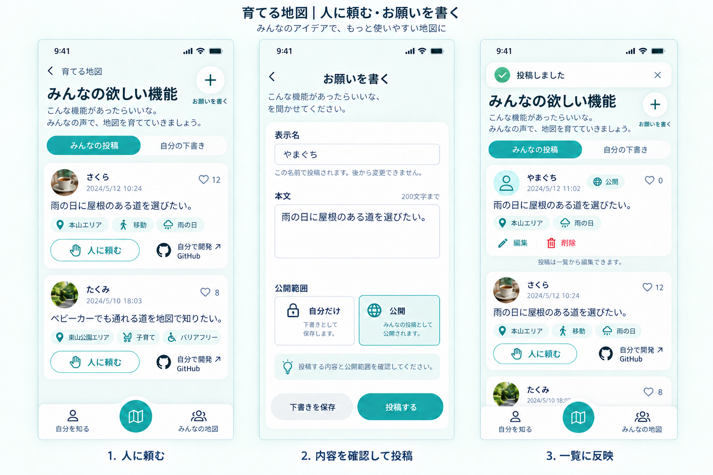

# みんなの欲しい機能の機能要件

## 目的

欲しい機能を共有し開発につなげる。

## このページでできること

| ID | 機能 | 操作後にできること・確認できる結果 |
|---|---|---|
| feature-requests-F01 | 投稿を読む | みんなの公開投稿と本人の下書きを切り替えられる。 |
| feature-requests-F02 | 共感を残す | 投稿に共感し件数を確認できる。 |
| feature-requests-F03 | 要望を書く | 本文を投稿・下書き保存して本人が編集・削除できる。 |
| feature-requests-F04 | 実現へ進む | 自分で開発はGitHubガイド、人に頼むは依頼相手を指定しないアプリ内フォームを開ける。 |

## 保存と再表示

本人の共感状態と、明示して確定した投稿の削除。依頼窓口を開いただけでは依頼を送信しない。

## 成立条件と例外

- 公開投稿と本人の下書きを分け、本人の投稿は編集・削除できる。人に頼むとGitHubの開発入口を用意し、非公開下書きを他者へ表示しない。
- 対象データがない場合は、その対象の0件状態と次にできる操作を表示する。取得できない状態を0件と同一視しない。
- 保存や取得に失敗した場合は入力と対象を保持し、処理結果が分かる状態で再試行できる。
- [共通要件](../common.json)の画面サイズ・文字拡大・メニュー開閉時の操作可能性を満たす。

## 確認済みの判断

- Q-REQUEST：依頼相手を指定しないアプリ内フォーム。既存のお願いを書く画面を共用する。外部URLは不要。
- Q-FORM-URL：アプリ内フォームのためURLの指定は不要。人に頼むはfeature-request-editへ移動する。

## 詳細との対応

[構成要素](components.json) / [操作・遷移](interactions.json) / [API](api.json) / [機能要件JSON](requirements.json) / [受入条件](acceptance.json)。
受入条件は未実行。機能の完了は表示だけでなく、必要な保存・再表示を含めて判断する。

## 画面イメージ

生成した設計参照画像。実ブラウザの動作検証画像ではない。
